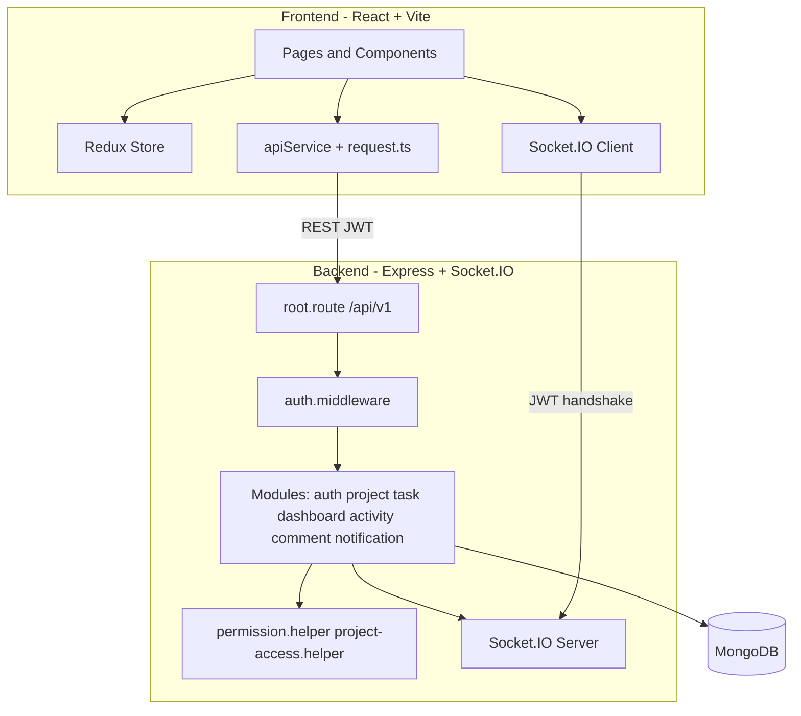
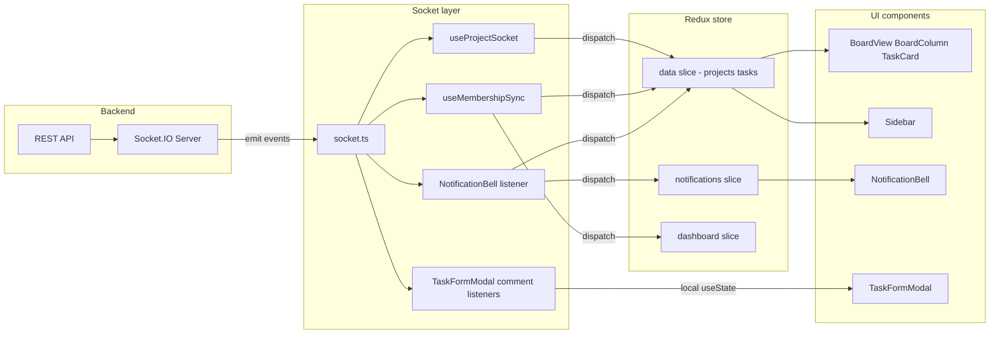
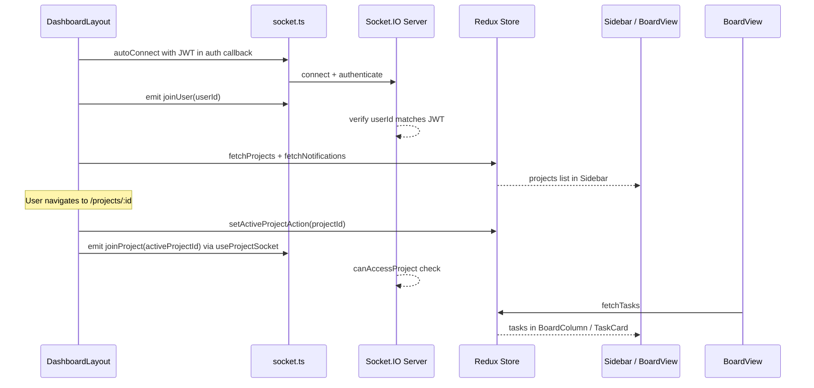
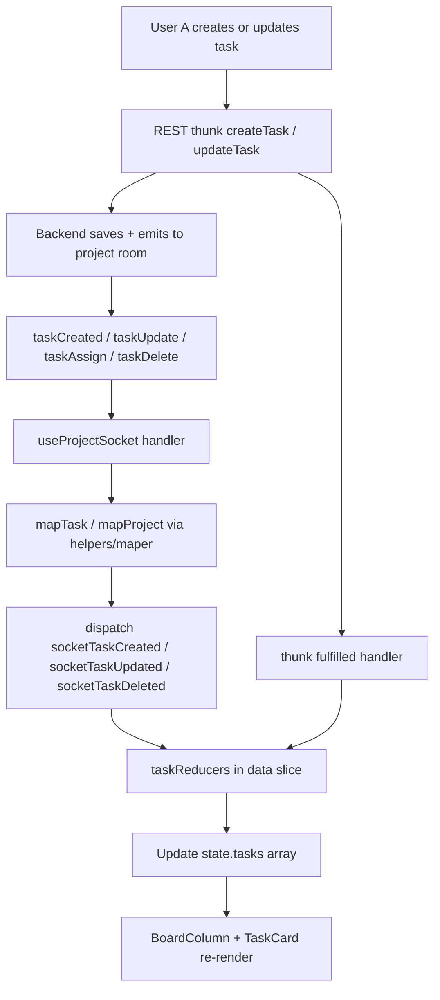
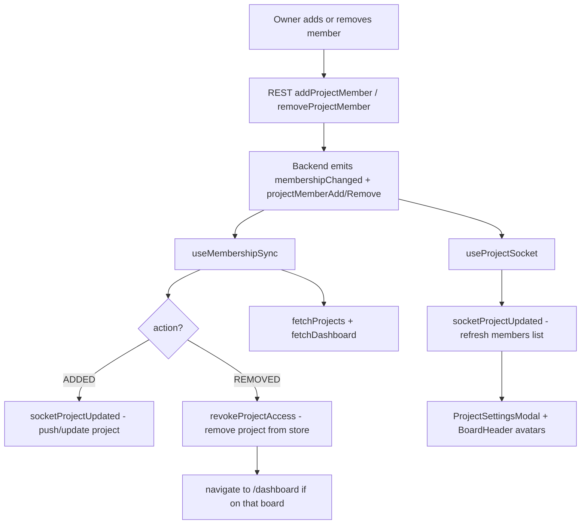
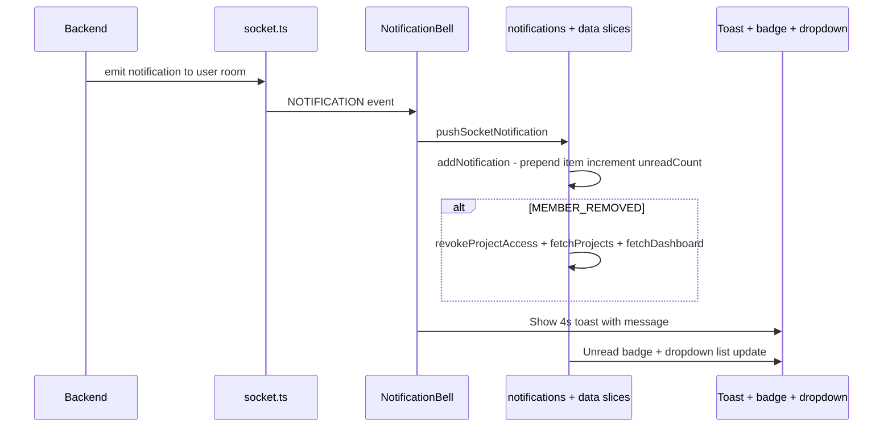
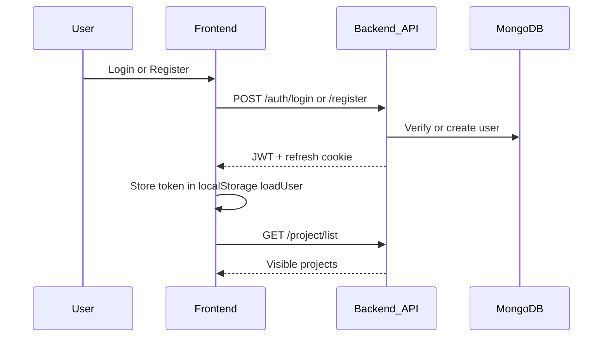
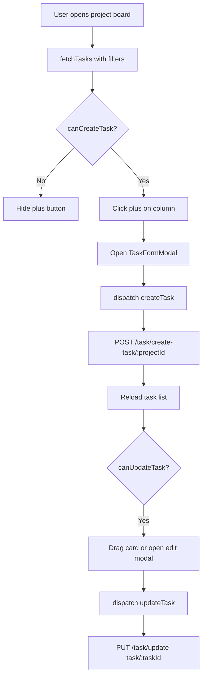
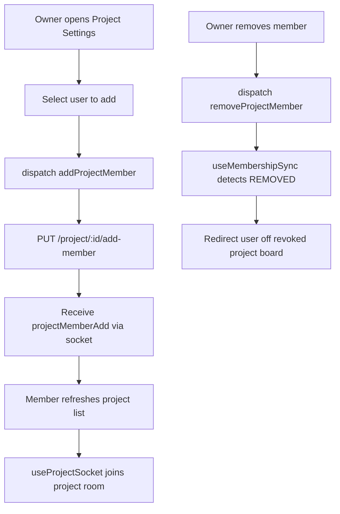

# TaskFlow Frontend

React + Vite client for **TaskFlow** — Smart Project & Task Collaboration System.

Companion backend: [`TaskFlow-backend-service`](https://github.com/KPorus/TaskFlow-backend-service)

---

## Table of Contents

- [Features Overview](#features-overview)
- [Project Setup](#project-setup)
- [Environment Variables](#environment-variables)
- [Demo Credentials](#demo-credentials)
- [Deployment](#deployment)
- [Role Model](#role-model)
- [Permissions (UI Gates)](#permissions-ui-gates)
- [System Architecture](#system-architecture)
- [Routes & Pages](#routes--pages)
- [File Structure](#file-structure)
- [Future Features (Roadmap)](#future-features-roadmap)

---

## Features Overview

TaskFlow is a real-time Kanban project management platform for teams. The frontend provides:

| Area | Capabilities |
|------|--------------|
| **Authentication** | Email/password login, registration, and one-click demo login |
| **Dashboard** | KPI cards, task charts, project summary, activity feed, workload view, upcoming deadlines, high-priority tasks |
| **Kanban board** | Project-scoped board with drag-and-drop status changes, search, filters, sort, and pagination |
| **Tasks** | Create/edit modal with title, description, status, priority, due date, assignee, and flat comments |
| **Projects** | Sidebar project list, project settings (add/remove members, delete project) |
| **Real-time** | Live task, project, membership, and notification updates via Socket.IO |
| **Notifications** | In-app notification bell with unread badge and toast messages |
| **Access control** | UI gates for global (`ADMIN` / `USER`) and project (`OWNER` / `MEMBER`) roles |

### Tech Stack

| Layer | Technology |
|-------|------------|
| UI | React 18 |
| Build | Vite 6 |
| Language | TypeScript |
| Routing | React Router 6 (`HashRouter`) |
| State | Redux Toolkit + React-Redux |
| Charts | Recharts |
| Icons | Lucide React |
| Real-time | Socket.IO Client |
| Styling | Tailwind-style utility classes |

---

## Project Setup

### Prerequisites

- **Node.js** 18+ and **pnpm** (recommended) or **npm**
- **TaskFlow backend** running locally or deployed — see [backend README](https://github.com/KPorus/TaskFlow-backend-service/blob/main/README.md)

### Local development

```bash
# Clone and enter the repo
git clone <your-repo-url>
cd TaskFlow-frontend-service

# Install dependencies
pnpm install   # or: npm install

# Configure environment (see Environment Variables below)
cp .env.example .env

# Start the dev server (port 3000)
pnpm run dev   # or: npm run dev
```

Open [http://localhost:3000](http://localhost:3000).

Ensure the backend API is reachable at `http://localhost:5000/api/v1` (default from `.env.example`).

### Scripts

| Command | Description |
|---------|-------------|
| `pnpm run dev` / `npm run dev` | Development server on port **3000** |
| `pnpm run build` / `npm run build` | Production build → `dist/` |
| `pnpm run preview` / `npm run preview` | Preview production build on port **4173** |

---

## Environment Variables

Copy `.env.example` to `.env` and adjust for your environment. Vite exposes only variables prefixed with `VITE_`.

| Variable | Description | Default |
|----------|-------------|---------|
| `VITE_BASE_URL` | Backend REST API base URL | `http://localhost:5001/api/v1` |
| `VITE_SOCKET_URL` | Socket.IO server URL (no `/api/v1` path) | `http://localhost:5001` |


For production, set both variables to your deployed backend origin before running `build`.

---

## Demo Credentials

Use these accounts to explore the app without registering, or click **Demo Login (Admin)** on the sign-in screen.

| Account | Email | Password | Global role |
|---------|-------|----------|-------------|
| Admin | `admin@taskflow.com` | `Admin@123` | `ADMIN` |

The demo admin has full access across all projects and system dashboard features. The backend must be running with seeded demo data for login to succeed.

---

## Deployment

The frontend is a static SPA. Build once, then host the `dist/` folder on any static file host.

### 1. Configure environment

Set production values for:

- `VITE_BASE_URL` — e.g. `https://api.yourdomain.com/api/v1`
- `VITE_SOCKET_URL` — e.g. `https://api.yourdomain.com`

These are baked in at **build time**; rebuild after changing them.

### 2. Build

```bash
pnpm install
pnpm run build   # or: npm run build
```

Output is written to `dist/`.

### 3. Host static files

| Platform | Build command | Output directory | Notes |
|----------|---------------|------------------|-------|
| **Vercel** | `npm run build` | `dist` | Set `VITE_*` env vars in project settings; `vercel.json` includes SPA rewrites |
<!-- | **Netlify** | `npm run build` | `dist` | Add `VITE_*` in Site settings → Environment variables |
| **Nginx / S3 / CDN** | — | Upload `dist/` contents | Serve `index.html` for unknown paths if not using hash routes | -->

The app uses **`HashRouter`** (`/#/dashboard`, etc.), so deep links work without server-side rewrite rules. SPA rewrites in `vercel.json` are included as a fallback for hosts that need them.

### 4. Backend requirements

- Backend CORS must allow your frontend origin.
- Socket.IO must be reachable at `VITE_SOCKET_URL` with JWT auth enabled.

### Local preview of production build

```bash
pnpm run preview
```

Opens the built app at [http://localhost:3000](http://localhost:3000).

---

## Role Model

TaskFlow uses **two layers** of roles. The UI gates features based on both.

### Global roles (from JWT / user object)

| Role | Description |
|------|-------------|
| `ADMIN` | System administrator. Bypasses project-level UI restrictions. |
| `USER` | Default role. Permissions depend on project membership. |

### Project roles (computed in UI)

| Role | How it is determined |
|------|----------------------|
| `OWNER` | `project.ownerId === currentUser.id` |
| `MEMBER` | User appears in `project.members[]` |

Defined and checked in `helpers/projectPermissions.ts`.

For demo login details, see [Demo Credentials](#demo-credentials).

---

## Permissions (UI Gates)

Source of truth: `helpers/projectPermissions.ts` and component usage.

| UI Action | ADMIN | OWNER | MEMBER | Helper / component |
|-----------|:-----:|:-----:|:------:|--------------------|
| Create project (sidebar) | Yes | Yes | Yes | `canCreateProject` — Sidebar |
| Open project board | Yes | Yes | Yes | `hasProjectAccess` — BoardView |
| "+" create task | Yes | Yes | Yes | `canCreateTask` — BoardColumn |
| Edit / drag tasks | Yes | Yes | Yes | `canUpdateTask` — BoardView, TaskCard |
| Assign / unassign in modal | Yes | Yes | Yes | TaskFormModal (via update flow) |
| Delete task button | Yes | Yes | Creator only* | `canDeleteTask` — BoardView |
| Project settings gear | Yes | Yes | No | `canManageProject` — BoardHeader |
| Add / remove members | Yes | Yes | No | ProjectSettingsModal |
| Delete project | Yes | Yes | No | ProjectSettingsModal |
| Delete any comment | Yes | Yes | Own comments only | TaskFormModal |
| System dashboard label | Yes | No | No | `isAdmin` — DashboardHome |
| Admin badge in sidebar | Yes | No | No | `isAdmin` — Sidebar |

\* **Known mismatch:** The UI shows the delete button to the task **creator**, but the backend only allows **project owner or admin** to delete tasks. Creators who are not owners will see the button but receive a 403 from the API.

### Permission helpers

| Helper | Logic |
|--------|-------|
| `isAdmin(user)` | `user.role === ADMIN` |
| `isProjectOwner(project, userId)` | `project.ownerId === userId` |
| `isProjectMember(project, userId)` | Owner or in `project.members` |
| `canManageProject(project, user)` | Admin or project owner |
| `canCreateProject(user)` | Any authenticated user with a role |
| `hasProjectAccess(projectId, projects)` | Project in user's fetched list |
| `canCreateTask(project, user)` | Admin or project member |
| `canUpdateTask(project, user)` | Same as `canCreateTask` |

---

## System Architecture



### Client architecture

| Layer | Files | Responsibility |
|-------|-------|----------------|
| Routes | `App.tsx` | Auth guards, HashRouter |
| Layout | `screen/DashboardLayout.tsx` | Sidebar, notifications, socket hooks |
| State | `store/slices/` | auth, data, dashboard, notifications |
| API | `services/apiService.ts`, `helpers/request.ts` | REST calls, token refresh on 401 |
| Real-time | `services/socket.ts`, `hooks/useProjectSocket.ts`, `hooks/useMembershipSync.ts` | Live task/project/notification updates |
| Permissions | `helpers/projectPermissions.ts` | UI access gates |

---

## Socket → Redux → UI Flow

Real-time updates use a single Socket.IO client (`services/socket.ts`) that authenticates with the JWT from `localStorage`. Hooks subscribe to events, dispatch Redux actions, and connected components re-render from the store.

### Overview



### Connection bootstrap

Runs once inside `DashboardLayout` when the user is authenticated:



| Step | Where | What happens |
|------|-------|--------------|
| Connect | `socket.ts` | `io(URL)` with `auth: { token }` from `localStorage` |
| Join user room | `DashboardLayout` | `emit("joinUser", user.id)` — receives personal notifications |
| Join project room | `useProjectSocket` | `emit("joinProject", activeProjectId)` when board is open |
| Initial data | `DashboardLayout` | `fetchProjects`, `fetchNotifications` on login |
| Active project | `BoardView` | `setActiveProjectAction` + `fetchTasks` on route change |

### Task events (create / update / delete)

When **any** user in the project room performs a task action, all connected clients receive the socket event. The acting user's UI is also updated via the REST thunk `fulfilled` handler (same reducers).



| Socket event | Redux action | Reducer effect | UI impact |
|--------------|--------------|----------------|-----------|
| `taskCreated` | `socketTaskCreated` | Push task if `activeProjectId` matches | New card appears in column |
| `taskUpdate` | `socketTaskUpdated` | Replace task by id in `state.tasks` | Card content/status/assignee updates |
| `taskAssign` | `socketTaskUpdated` | Same as update | Assignee avatar changes |
| `taskDelete` | `socketTaskDeleted` | Remove task; decrement `taskTotal` | Card removed from board |
| `memberAssigneesCleared` | `clearMemberTaskAssignees` | Set `assigneeId` undefined for member's tasks | Assignee badges cleared |

### Project and membership events

Two hooks handle project-level changes:

| Hook | Events listened | Redux actions | UI impact |
|------|-----------------|---------------|-----------|
| `useProjectSocket` | `projectUpdated`, `projectMemberAdd`, `projectMemberRemove`, `projectDeleted` | `socketProjectUpdated`, `socketProjectDelete` | Sidebar project list; board header members |
| `useMembershipSync` | `membershipChanged` | `socketProjectUpdated`, `revokeProjectAccess`, `fetchProjects`, `fetchDashboard` | Added project appears; removed user redirected to `/dashboard` |



### Notification events

`NotificationBell` and `useMembershipSync` both listen to `notification`. `pushSocketNotification` updates the notifications slice and may trigger data refreshes.



### Comments (exception: local state, not Redux)

Task comments are **not** stored in Redux. `TaskFormModal` listens to socket events and updates local `useState` when the modal is open:

| Socket event | Handler | State |
|--------------|---------|-------|
| `commentAdded` | Append to `comments` if same `taskId` | `useState` in `TaskFormModal` |
| `commentDeleted` | Filter out deleted id | `useState` in `TaskFormModal` |

Creating a comment still goes through REST (`ApiService.comments.create`); the backend emits `commentAdded` to the project room so other open modals update live.

### Redux slices touched by sockets

| Slice | Socket-driven actions | Consumed by |
|-------|----------------------|-------------|
| `data` | `socketTaskCreated`, `socketTaskUpdated`, `socketTaskDeleted`, `socketProjectUpdated`, `socketProjectDelete`, `revokeProjectAccess`, `clearMemberTaskAssignees` | `BoardView`, `Sidebar`, `BoardHeader` |
| `notifications` | `addNotification` (via `pushSocketNotification`) | `NotificationBell` |
| `dashboard` | Refetched on membership change (not direct socket reducer) | `DashboardHome` widgets |

### REST vs socket: who updates the UI?

| User action | Immediate UI update | Other users in room |
|-------------|--------------------|---------------------|
| Create task | `createTask.fulfilled` → `applySocketTaskCreated` | `taskCreated` socket → same reducer |
| Update / drag task | `updateTask.fulfilled` → `applyTaskUpdated` | `taskUpdate` socket → same reducer |
| Delete task | `deleteTask.fulfilled` → `applyTaskDeleted` | `taskDelete` socket → same reducer |
| Add comment | Local state after REST response | `commentAdded` socket → modal local state |

---

## Activity Diagrams (Core Features)

### Authentication and session



### Task lifecycle (create, assign, drag status)



### Project membership and real-time sync



---

## Routes & Pages

| Route | Guard | Component | Purpose |
|-------|-------|-----------|---------|
| `/` | — | Redirect | → `/dashboard` or `/login` |
| `/login` | Unauthenticated | `AuthScreen` | Login, register, demo |
| `/dashboard` | Authenticated | `DashboardLayout` | App shell |
| `/dashboard` (index) | Nested | `DashboardHome` | Analytics dashboard |
| `/dashboard/projects/:projectId` | Nested | `BoardView` | Kanban board |

---

## File Structure

```
TaskFlow-frontend-service/
├── App.tsx                    # Root router + auth gate
├── index.tsx                  # React entry + Redux Provider
├── types.ts                   # Shared TypeScript types/enums
├── vite.config.ts             # Vite config (port 3000)
│
├── screen/
│   └── DashboardLayout.tsx    # Authenticated shell
│
├── components/
│   ├── auth/
│   │   └── AuthScreen.tsx     # Login / register / demo
│   ├── board/
│   │   ├── BoardView.tsx      # Kanban orchestration
│   │   ├── BoardColumn.tsx    # Status column
│   │   ├── BoardHeader.tsx    # Project header
│   │   ├── TaskCard.tsx       # Draggable task card
│   │   └── TeamMembersAvatarGroup.tsx
│   ├── dashboard/
│   │   ├── DashboardHome.tsx
│   │   ├── KpiCards.tsx
│   │   ├── TaskCharts.tsx
│   │   ├── ProjectSummaryList.tsx
│   │   ├── ActivityFeed.tsx
│   │   ├── WorkloadSummary.tsx
│   │   ├── UpcomingDeadlines.tsx
│   │   └── HighPriorityTasks.tsx
│   ├── layout/
│   │   ├── Sidebar.tsx
│   │   └── NotificationBell.tsx
│   ├── model/
│   │   ├── TaskFormModal.tsx
│   │   ├── ProjectSettingsModal.tsx
│   │   └── DeleteTaskConfirmModal.tsx
│   ├── search/
│   │   ├── SearchBar.tsx
│   │   ├── TaskFilters.tsx
│   │   ├── SortControls.tsx
│   │   └── Pagination.tsx
│   └── ui/
│       ├── Modal.tsx
│       └── ErrorBanner.tsx
│
├── helpers/
│   ├── projectPermissions.ts  # Role/access helpers
│   ├── authSession.ts
│   ├── request.ts             # Fetch wrapper + token refresh
│   ├── maper.ts               # API → frontend mappers
│   └── getId.ts
│
├── hooks/
│   ├── useProjectSocket.ts
│   └── useMembershipSync.ts
│
├── services/
│   ├── apiService.ts          # REST API facade
│   └── socket.ts              # Socket.IO client
│
└── store/
    ├── store.ts
    └── slices/
        ├── authSlice.ts
        ├── dataSlice.ts
        ├── dashboardSlice.ts
        ├── notificationSlice.ts
        └── helper/
            ├── authThunks.ts
            ├── dataThunks.ts
            ├── projectReducers.ts
            ├── taskReducers.ts
            └── socketReducers.ts
```

---

## Future Features (Roadmap)

Planned improvements not yet implemented:
- Otp based login system
- Granular project roles (viewer / editor) with UI gates per role
- Email and push notifications
- Task attachments and rich-text editor
- Subtasks, labels, and dependencies
- OAuth / SSO login
- Component and integration tests
- `@mentions` in comments
- Project templates
- Improved mobile layout and PWA support
